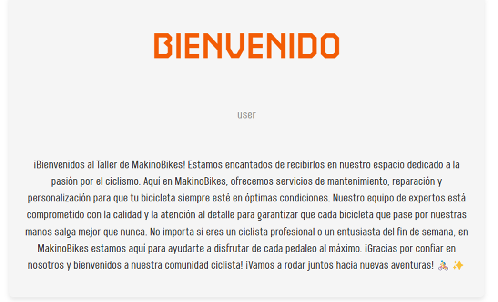
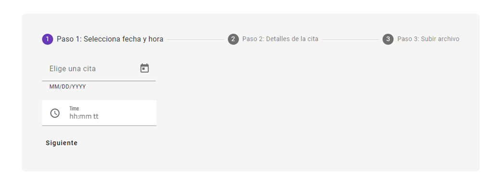
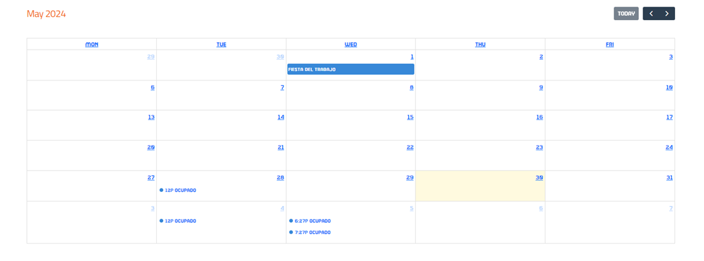
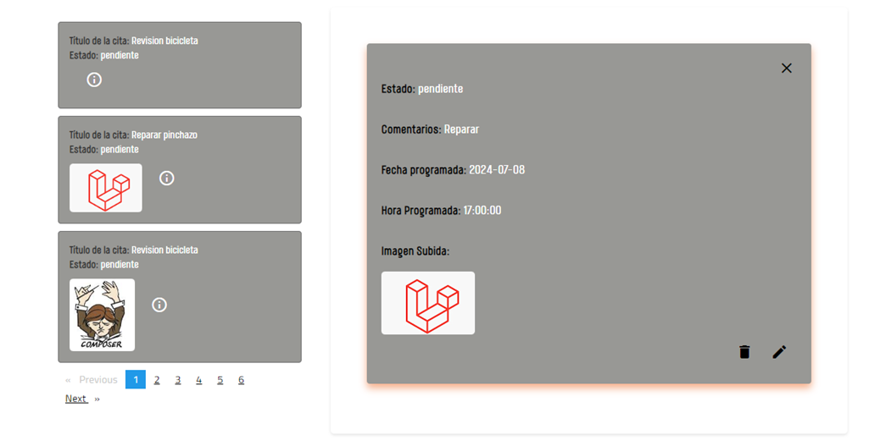
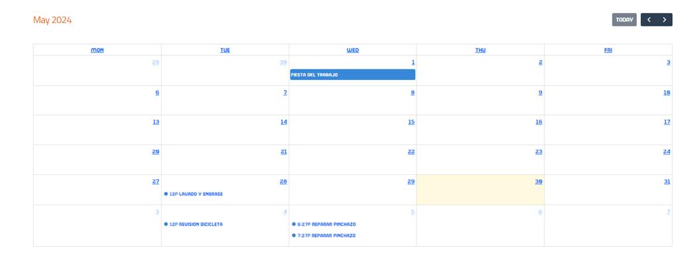
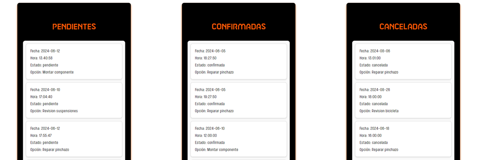

Makinon Bikes es una aplicación web de comercio electrónico desarrollada en Laravel. La aplicación está diseñada para proporcionar una plataforma donde los usuarios pueden explorar y comprar una variedad de productos relacionados con bicicletas y accesorios pra el ciclista. La aplicación se ha desarrollado con un enfoque en la facilidad de uso, la eficiencia y la escalabilidad.
Esto en cuanto al usuario final, pero en cuanto al enfoque hacia el administrador de la página nos permite un control total sobre proveedores, productos y los propios usuarios. 
Además, se ha integrado un sistema de gestión de citas para un taller de bicicletas. El sistema permite a los usuarios gestionar citas mientras proporciona a los administradores herramientas para supervisar y analizar las actividades del taller

 

## Direcciones web
Makinon Bikes - https://www.makinonbikes.duckdns.org
Sistema de citas de taller Makinon Bikes - https://tallermakinonbikes.netlify.app
Landing page - https://www.makinonbikes-landing.duckdns.org

## Makinon en imágenes
### Tienda
Cuando el usuario accede a nuestra página podrá, de manera intuitiva, acceder a todos los apartados disponibles para él, pero también podrá decidir si logearse o crear su cuenta rellenando los campos del formulario de registro, el cual cuenta con un sistema de control de errores para todos los campos.
Una vez registrado el usuario recibe en su correo electrónico un mail confirmando el registro.

    
        
     

 

En el caso de acceder con perfil de administrador desde el dropdown que aparece junto al nombre del usuario se accede al "Panel de Administración" donde tendremos, como ya dijimos, un control total sobre proveedores, productos, usuarios registrados en nuestra página y pedidos que se han realizado a nuestra web.

    
    
        
    

 

Hemos implementado ademas un sistema de citas para el taller, en el cual, el cliente logeado, a través de la página del taller y mediante el enlace es redirigido a la apliación de citas que hemos desarrolado en Angular, y desde esa apliación el usuario, como bien decimos podrá solicitar una cita, recuperar todas sus citas, modificarla y o cancelarla, así como se le permitirá añadir fotografía de su bicicleta para la valoración de los mecánicos.

 

 

### Taller
Cuando accede tanto el usuario o el admin se le visualizará una presentación de bienvenida

  

En el lado usuario se puede solicitar una cita al taller pasando por un formulario por pasos

  

También se visualizará un calendario con las fechas y horas disponibles pero con restricciones de título. En este caso se le mostrará un título de ocupado. Además, se visualiza los festivos en España y en Andalucia en el calendario

  

Otro sección, es la visualización de todas las citas del usuario logueado y su descripción completa. Además tiene la posibilidad de modificar una cita programada si aún está en estado pendiente.

  

Acabando en el lado usuario, tenemos otra sección en que muestra la dirección de google maps del taller.

  

En el lado administrador se muestra el mismo calendario que el usuario pero con la posibilidad de ver el título de la cita sin las restricciones ya mencionadas

  

El administrador tiene la particularidad de modificar los estado de las citas

  

Por último, se puede mostrar varias gráficas para visualizar que estados hay más en el taller, cuando hay más citas y que tipo de opciones son las más demandadas para tener un control más exhaustivo de la demanda de los usuarios

    
    
        

## Tecnologías utilizadas
 

    
    
    
    
    
    
    
    
    

 

- **Laravel**: Laravel es un marco de trabajo de PHP que se utiliza para desarrollar la aplicación. Nos proporciona una estructura y una serie de herramientas útiles para desarrollar aplicaciones web robustas y seguras.
  
- **Angular**: Es un framework para aplicaciones web desarrollado en TypeScript, de código abierto, mantenido por Google, que se utiliza para crear y mantener aplicaciones web de una sola página.

- **MySQL**: MySQL se utiliza como sistema de gestión de bases de datos. Almacena todos los datos relacionados con la aplicación, incluyendo productos, proveedores y usuarios.

- **Bootstrap**: Bootstrap se utiliza para el diseño y el estilo de la aplicación, haciendo que la aplicación sea responsive y se vea bien en una variedad de dispositivos y tamaños de pantalla.

- **Tailwind CSS**: Según su propio sitio web, es un "framework CSS que prioriza las utilidades", proporciona varias de estas clases de utilidades de un solo propósito que puedes utilizar directamente dentro de tu HTML para diseñar un elemento.

- **Vite**: Nos proporciona un entorno de desarrollo instantáneo y con tiempos de compilación muy rápidos. Utiliza un enfoque de desarrollo basado en el servidor y nos sirve el código en tiempo real durante el desarrollo. Esto significa que no es necesario realizar una compilación completa cada vez que se realizan cambios en el código, lo que resulta en tiempos de respuesta mucho más rápidos.

- **Git**: Git se utiliza para el control de versiones. Ayudando a rastrear los cambios en el código a lo largo del tiempo y facilita la colaboración entre los posibles desarrolladores.

- **Netlify**: es una plataforma de desarrollo web que facilita la publicación de sitios web. Ofrece servicios de alojamiento y backend sin servidor para aplicaciones web estáticas y dinámicas

- **aws**: es una plataforma de servicios de computación en la nube que ofrece una amplia gama de recursos y soluciones para empresas, desarrolladores e instituciones
 

## Futuras implementaciones.
- **Creación de facturas**: Trataremos de implementar un sistema de facturas en la cual, nada mas realizarse la compra por parte del cliente, este reciba un correo con la copia de la factura en el caso de que el pago sea mediante tarjeta de crédito. Del mismo modo el usuario podrá consultar las facturas de sus pedidos desde sus pedidos.

## Autores
- [Jose Antonio Holgado Bonet](https://github.com/joseaholgado)
- [Alberto Moreno Fernandez](https://github.com/AlbertoMorenoFdez)

## Vídeos
-[Pre-proyecto](https://youtu.be/8cHSNUbqt6M)  
-[Proyecto FCT Makinon Bikes](https://youtu.be/x7kCHsrtQvM)

## Recursos adicionales
- [Página de Notion del proyecto](https://messy-sovereign-e65.notion.site/Anteproyecto-Makinon-Bikes-11a74f6f479342049f4cd17ddec853e3?pvs=4)
